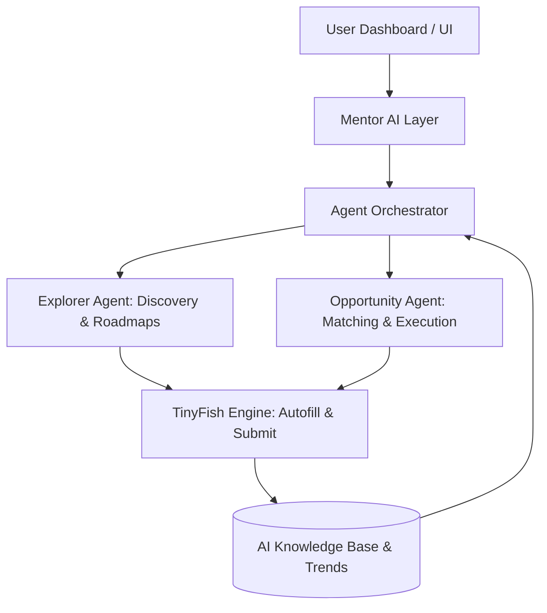

# BridgeSkill - AI-Powered Career Navigator

BridgeSkill is a modern AI-assisted learning and opportunity platform that helps users explore skills, build roadmaps, and apply those skills in real-world career paths.

## Project Overview

BridgeSkill combines tinyfish web ai agent for exploration and web autumation.

Current product focus:

- Guided skill discovery and learning direction
- Multi-mode journey design for learners, researchers, and founders

## Architecture



## Key Features

### Product Modes

- Learner Mode: roadmap-oriented learning guidance
- Researcher Mode: research direction and opportunity guidance
- Founder Mode: startup exploration and execution support

## Technology Stack

- Framework: Next.js 16 (App Router)
- Runtime/UI: React 19, TypeScript
- Styling: Tailwind CSS v4
- Auth: Better Auth + better-auth/next-js
- Database: MongoDB + @better-auth/mongo-adapter
- Validation: Zod
- UI Motion and Icons: Framer Motion, Lucide React

## Project Structure

```text
app/
	api/auth/[...all]/route.ts      # Better Auth handler
	login/page.tsx                  # Auth entry page
	dashboard/page.tsx              # Protected app area
	mentor/page.tsx                 # Mentor route
	about/page.tsx                  # Product overview
lib/
	actions/auth-actions.ts         # Server auth actions
	auth/                           # Better Auth config and client
	schemas/auth-schema.ts          # Zod auth validation
	errors.ts                       # Safe error normalization
ui/
	components/AuthForm.tsx         # Shared login/signup form
	components/FeatureOrb.tsx
	hooks/use-auth-form.ts
proxy.ts                          # Route guarding logic
```

## Prerequisites

- Node.js 20+
- npm 10+
- MongoDB instance (local or hosted)

## Quick Start

### 1. Install dependencies

```bash
npm install
```

### 2. Configure environment

Create a `.env` file in the project root:

```env
MONGODB_URI=mongodb://localhost:27017/bridgeskill
BETTER_AUTH_SECRET=replace_with_a_long_random_secret
NEXT_PUBLIC_URL=http://localhost:3000
```

### 3. Run development server

```bash
npm run dev
```

Open http://localhost:3000 in your browser.

## Current Status

Implemented now:

- Core public pages and layout
- Auth API integration and sessions
- Login/signup unified form with password visibility toggle
- Protected route gating for dashboard

In progress:

- Dashboard feature expansion
- Mentor workflows and deeper agent capabilities

---

**Built with passion to solve real problems for self-taught learners, researchers, and founders.**
